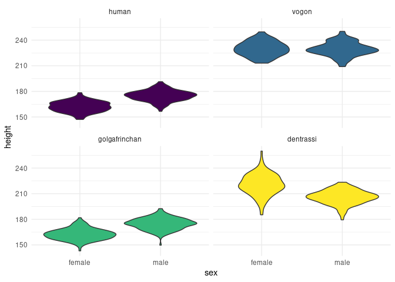

<!-- README.md is generated by README.Rmd. Please edit .Rmd file. -->

# hitchr 

<!-- badges: start -->

[](https://github.com/bbartholdy/hitchr/actions)
[](https://codecov.io/gh/bbartholdy/hitchr?branch=main)
[](https://bbartholdy.r-universe.dev)
<!-- badges: end -->

Random sample generator inspired by Douglas Adams’ The Hitchhiker’s
Guide to the Galaxy. It also allows random insertion of NAs in a dataset
(inspired by the [wakefield](https://github.com/trinker/wakefield)
package).

Currently in development.

To install:

``` r
devtools::install_github("bbartholdy/hitchr")
```

## :exclamation:Important Note:exclamation:

This package deals with the concept of ‘race’ in a strictly biological
sense; i.e., there is no way to biologically distinguish discrete races
within the *Homo sapiens* species (despite claims to the contrary).

This should not distract from the very real concept of social ‘race’,
and the social injustice that currently persists across the globe.

[BlackLivesMatter](https://blacklivesmatter.com/)

[StopAsianHate](https://www.stopasianhate.info/)

## Examples

``` r
hitchr::infinite_improbability_drive(10) # generates a random sample of 10 individuals
# or
hitchr::iidr(10)
```

| race          | sex    | age |   height |    weight |  IQ | occupation                                 |
|:--------------|:-------|----:|---------:|----------:|----:|:-------------------------------------------|
| human         | female |  96 | 168.6519 |  69.85078 | 105 | Private Sector Executives                  |
| vogon         | other  |  58 | 221.1757 | 330.25662 | 125 | Educational Administrator                  |
| vogon         | male   |  78 | 228.4906 | 347.81608 | 120 | Correspondence Clerk                       |
| dentrassi     | male   |  67 | 219.2894 | 167.68239 | 108 | Senior Chef                                |
| dentrassi     | female |  37 | 234.6897 | 159.88330 | 103 | Catering Manager                           |
| golgafrinchan | male   |  48 | 173.4461 |  88.76329 |  88 | Telephone Sanitiser                        |
| vogon         | other  |  83 | 239.3880 | 356.35169 | 118 | Radio & TV Station Administrator           |
| human         | female | 101 | 150.7992 |  59.83803 |  77 | Sociology Professor                        |
| human         | male   |  86 | 176.2204 |  88.30514 |  98 | Traffic Technicians                        |
| human         | male   |  52 | 182.7481 |  91.65596 | 107 | Sales Representitive (Psychological Tests) |

Missing values can be inserted symmetrically (symm = T): equal number of
NAs in each column, or asymmetrically (symm = F): random distribution in
the columns. To insert missing values, specify the desired proportion of
missing values (0 to 1).

``` r
hitchr::iidr(10, na_prob = 0.2, symm = T)
```

| race          | sex    | age |   height |    weight |  IQ | occupation                                |
|:--------------|:-------|----:|---------:|----------:|----:|:------------------------------------------|
| human         | NA     |  80 | 157.9002 |  50.09614 | 105 | NA                                        |
| NA            | female | 148 |       NA | 340.34108 |  NA | Hospital Administrator                    |
| golgafrinchan | female |  92 | 142.8915 |  40.63229 |  87 | Lawyer                                    |
| dentrassi     | male   |  52 | 190.6590 | 152.21343 | 102 | Sous Chef                                 |
| dentrassi     | female |  14 | 240.9271 | 187.54610 |  NA | Meat Chef                                 |
| golgafrinchan | male   |  NA | 183.7253 |        NA | 103 | Telephone Sanitiser                       |
| vogon         | female |  65 | 242.8901 | 374.37214 | 118 | Assistant to the Administrative Assistant |
| golgafrinchan | NA     |  NA | 162.9730 |  70.51134 |  92 | Hairdresser                               |
| NA            | female |  46 |       NA | 204.46458 |  96 | NA                                        |
| dentrassi     | female |  50 | 229.9627 |        NA |  94 | Short Order Cook                          |

Races currently available:

``` r
hitchr:::race_index()
```

    ## [1] "humans"         "vogons"         "golgafrinchans" "dentrassi"

Stats currently available:

``` r
hitchr:::stats_index()
```

    ## [1] "race"       "sex"        "age"        "height"     "weight"    
    ## [6] "IQ"         "occupation"

Sexual dimorphism in the height of males and females of different races:

``` r
hitchr_sample <- hitchr::iidr(1000)
hitchr_sample %>%
  filter(sex == "male" | sex == "female") %>%
  group_by(race) %>%
  ggplot(aes(x = sex, y = height, fill = race)) +
    geom_violin() +
    theme_minimal() +
    scale_fill_viridis_d() +
    facet_wrap(~ race) +
    theme(legend.position = "none")
```

<!-- -->
