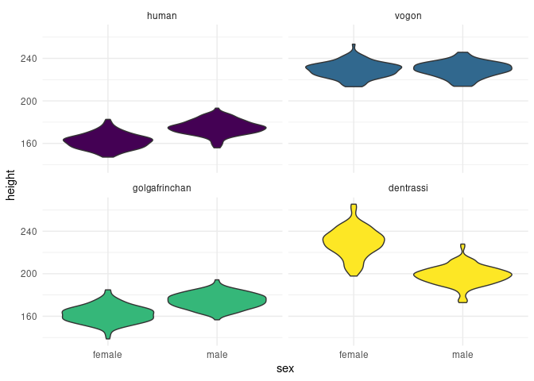

<!-- README.md is generated by README.Rmd. Please edit .Rmd file. -->

# hitchr 

<!-- badges: start -->

[](https://github.com/bbartholdy/hitchr/actions)
[](https://codecov.io/gh/bbartholdy/hitchr?branch=master)
<!-- badges: end -->

Random sample generator inspired by Douglas Adams’ The Hitchhiker’s
Guide to the Galaxy. It also allows random insertion of NAs in a dataset
(inspired by the [wakefield](https://github.com/trinker/wakefield)
package).

Currently in development.

To install:

``` r
remotes::install_github("bbartholdy/hitchr")
```

## :exclamation:Important Note:exclamation:

This package deals with the concept of ‘race’ in a strictly biological
sense; i.e., there is no way to biologically distinguish discrete races
within the *Homo sapiens* species (despite claims to the contrary).

This should not distract from the very real concept of social ‘race’,
and the social injustice that currently persists across the globe.

[BlackLivesMatter](https://blacklivesmatter.com/)

[StopAsianHate](https://www.stopasianhate.info/)

## Examples

``` r
hitchr::infinite_improbability_drive(10) # generates a random sample of 10 individuals
# or
hitchr::iidr(10)
```

| race          | sex    | age |   height |    weight |  IQ | occupation                      |
|:--------------|:-------|----:|---------:|----------:|----:|:--------------------------------|
| golgafrinchan | female |  75 | 160.7486 |  71.34171 |  79 | Lawyer                          |
| golgafrinchan | male   |  88 | 180.5427 |  92.66954 |  96 | Telephone Sanitiser             |
| dentrassi     | male   |  22 | 159.6553 | 144.90796 | 116 | Senior Chef                     |
| vogon         | male   | 142 | 234.4148 | 364.43622 | 124 | Constructor Fleet Administrator |
| dentrassi     | male   |  76 | 168.7561 | 139.27380 | 101 | Vegetable Chef                  |
| golgafrinchan | female |  94 | 164.2331 |  66.20763 |  99 | Lawyer                          |
| golgafrinchan | male   |  17 | 167.8532 |  70.56446 | 108 | Telephone Sanitiser             |
| dentrassi     | female |  48 | 330.4523 | 206.29692 | 102 | Vegetable Chef                  |
| human         | male   | 116 | 181.6672 |  93.58805 | 107 | Radio & TV Newscaster           |
| vogon         | female | 132 | 234.9198 | 362.91644 | 128 | Cost Accountant                 |

Missing values can be inserted symmetrically (symm = T): equal number of
NAs in each column, or asymmetrically (symm = F): random distribution in
the columns. To insert missing values, specify the desired proportion of
missing values (0 to 1).

``` r
hitchr::iidr(10, na_prob = 0.2, symm = T)
```

| race          | sex    | age |   height |    weight |  IQ | occupation                           |
|:--------------|:-------|----:|---------:|----------:|----:|:-------------------------------------|
| vogon         | male   |  NA | 236.4337 | 360.01617 | 117 | Education and Training Administrator |
| dentrassi     | male   |  79 | 271.0564 | 164.04972 |  97 | Sauce Chef                           |
| human         | female |  54 |       NA |        NA | 112 | Medical Secretary                    |
| NA            | female |   1 | 159.6122 |        NA |  84 | Lawyer                               |
| human         | NA     |  78 |       NA |  85.86503 |  NA | Fraud Investigator                   |
| vogon         | female | 179 | 220.3853 | 343.59491 |  NA | NA                                   |
| human         | NA     |  95 | 156.6267 |  56.92940 |  97 | Physician’s Office Nurse             |
| golgafrinchan | female |  11 | 165.8895 |  58.64694 | 118 | NA                                   |
| golgafrinchan | female |  85 | 161.0003 |  59.12484 | 105 | Hairdresser                          |
| NA            | male   |  NA | 170.9844 |  81.70233 |  98 | Hairdresser                          |

Races currently available:

``` r
hitchr:::race_index()
```

    ## [1] "humans"         "vogons"         "golgafrinchans" "dentrassi"

Stats currently available:

``` r
hitchr:::stats_index()
```

    ## [1] "race"       "sex"        "age"        "height"     "weight"    
    ## [6] "IQ"         "occupation"

Sexual dimorphism in the height of males and females of different races:

``` r
hitchr_sample <- hitchr::iidr(1000)
hitchr_sample %>%
  filter(sex == "male" | sex == "female") %>%
  group_by(race) %>%
  ggplot(aes(x = sex, y = height, fill = race)) +
    geom_boxplot() +
    theme_minimal() +
    scale_fill_viridis_d() +
    facet_wrap(~ race) +
    theme(legend.position = "none")
```

<!-- -->
